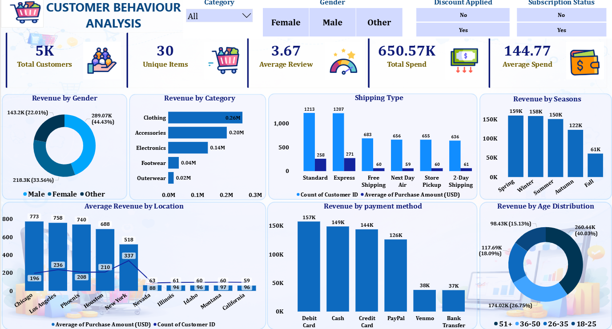
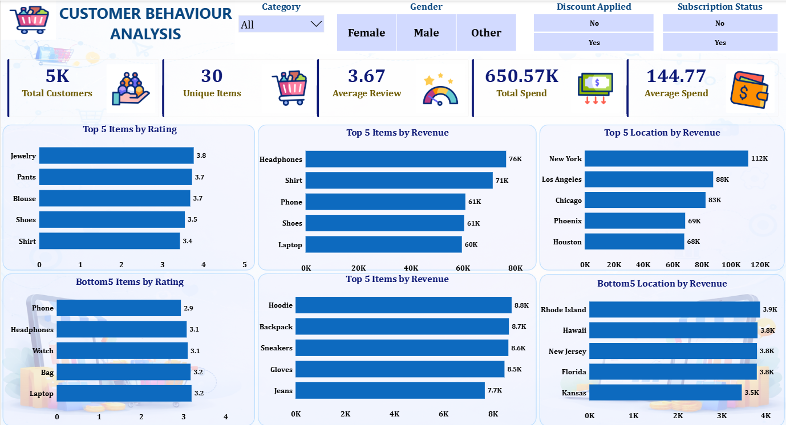

# 📊 Customer Behaviour Analysis | Power BI Dashboard

## 🚀 Project Overview
This project focuses on analyzing customer purchasing behavior using real-world retail data. The objective was to extract meaningful business insights from customer transactions and visualize them through interactive Power BI dashboards.

The project covers the complete analytics workflow including:
- Data Cleaning using Python
- Data Validation & QA using SQL
- Data Visualization using Power BI

This is an end-to-end data analytics project designed to simulate an industry-level business intelligence solution.

---

# 🛠️ Tools & Technologies Used

- Python (Pandas, NumPy)
- SQL
- Power BI
- Excel / CSV Dataset

---

# 📂 Project Workflow

## 1️⃣ Data Cleaning with Python
Performed data preprocessing and cleaning using Python:
- Removed duplicate records
- Handled missing values
- Corrected inconsistent data
- Standardized categorical values
- Prepared dataset for analysis

---

## 2️⃣ Data Validation & QA with SQL
Used SQL queries for:
- Data quality checks
- Validation of metrics
- Revenue verification
- Customer segmentation analysis
- Identifying inconsistencies in records

---

## 3️⃣ Dashboard Development in Power BI
Built interactive dashboards to analyze:
- Customer spending patterns
- Revenue distribution
- Product category performance
- Age & gender analysis
- Seasonal revenue trends
- Payment methods
- Shipping preferences
- Top & bottom performing products and locations

---

# 📈 Key Business Insights

- Male customers contributed the highest revenue share.
- Clothing category generated maximum revenue.
- Debit Card and Cash were the most used payment methods.
- Spring and Winter seasons showed highest sales.
- New York generated the highest revenue among all locations.
- Specific products showed significantly higher customer ratings and revenue generation.

---

# 📊 Dashboard Features

✔ Interactive Filters & Slicers  
✔ KPI Cards  
✔ Revenue Analysis  
✔ Customer Segmentation  
✔ Product Performance Analysis  
✔ Location-Based Insights  
✔ Seasonal Trend Analysis  
✔ Dynamic Visualizations

---

# 📷 Dashboard Preview

## Dashboard 1


## Dashboard 2


---

# 📁 Repository Structure

```text
Customer-Behaviour-Analysis-PowerBI/
│
├── Dataset/
├── Python_Data_Cleaning/
├── SQL_QA_Queries/
├── PowerBI_Dashboard/
├── dashboard1.png
├── dashboard2.png
├── Customer_Behaviour_Analysis.pbix
└── README.md
```

---

# 🎯 Project Objective

The main goal of this project was to:
- Improve analytical thinking
- Practice real-world data cleaning
- Perform business-focused analysis
- Build professional Power BI dashboards
- Generate actionable business insights from raw data

---

# 👨‍💻 Author

Atul Sharma

Aspiring Data Analyst skilled in:
- Excel
- SQL
- Power BI
- Python

